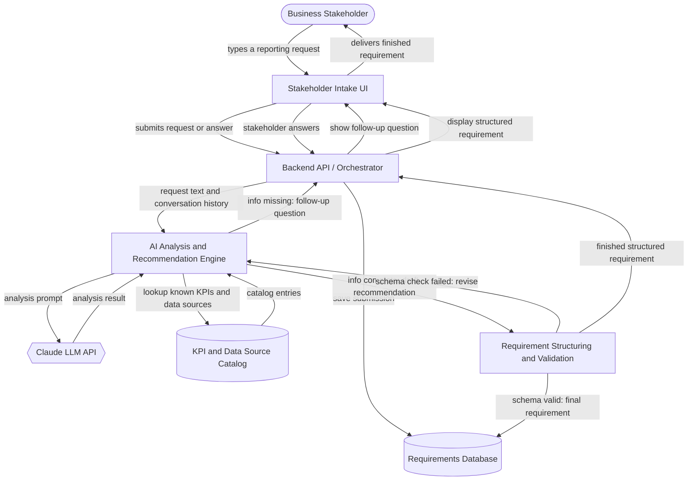

# Architecture: AI-Powered Power BI Requirements System

## The Idea

> Build an AI-powered Power BI requirement system for business stakeholders. Users submit their reporting requirements, the system analyzes and stores them, asks follow-up questions when information is missing, and recommends the appropriate data sources, KPIs, and report structure. On day one, it must turn a stakeholder's business request into clear, structured Power BI requirements.

The sentence that outranks everything else: **"On day one, it must turn a stakeholder's business request into clear, structured Power BI requirements."** One component exists specifically to guarantee this — **Requirement Structuring and Validation** (below) — and Build Order Phase 4 is built around proving it.

## Components

Seven components. No auth, no notifications, no queue — the paragraph doesn't say or imply any of them, so they aren't here (see [What This Design Does Not Cover](#what-this-design-does-not-cover)).

| Component | What it does for this project | Words that required it |
|---|---|---|
| **Stakeholder Intake UI** | Gives business stakeholders a plain-language place to submit a request and see/answer follow-up questions. | "business stakeholders", "Users submit" |
| **Backend API / Orchestrator** | Routes each submission and answer between the UI, the AI engine, and storage, and keeps track of where a conversation is. | "the system analyzes and stores them" |
| **AI Analysis and Recommendation Engine** | Reads the request for meaning, decides what's missing, writes the next follow-up question, and drafts which KPIs, data sources, and report structure fit. | "analyzes", "asks follow-up questions when information is missing", "recommends the appropriate data sources, KPIs, and report structure" |
| **Claude LLM API** *(third party)* | Supplies the actual language understanding and generation the AI engine calls on — this system doesn't train its own model. | "analyzes", "recommends" |
| **KPI and Data Source Catalog** | Holds the organization's real, known KPIs and data sources so a recommendation can be checked against what's actually "appropriate" instead of invented. | "recommends the **appropriate** data sources, KPIs" |
| **Requirements Database** | Keeps every submission, follow-up exchange, and finished requirement so the record outlives the browser session. | "stores them" |
| **Requirement Structuring and Validation** | Forces the AI's draft into a fixed requirements schema and bounces it back for revision if it doesn't fit. **This is the component that guarantees the day-one promise** — a clear, structured result every time, not just a reasonable-sounding paragraph when the AI happens to format it well. | "clear, structured Power BI requirements" |

## How It Fits Together

## Data Flow

1. The stakeholder types a business reporting request into the **Intake UI**.
2. The Intake UI submits the request text to the **Backend API**.
3. The Backend API saves the raw submission to the **Requirements Database**.
4. The Backend API forwards the request text and conversation history to the **AI Analysis Engine**.
5. The AI Engine sends an analysis prompt to the **Claude LLM API**.
6. The AI Engine checks the response against the **KPI and Data Source Catalog** to see what's actually known and available.
7. **If information is missing**: the AI Engine writes a follow-up question, the Backend API shows it in the UI, the stakeholder answers, and the flow returns to step 2.
8. **If information is complete**: the AI Engine drafts KPIs, data sources, and report structure, and passes the draft to **Requirement Structuring and Validation**.
9. Structuring and Validation checks the draft against the fixed requirements schema. An invalid draft goes back to the AI Engine for revision (loop back to step 8).
10. A valid draft is saved to the **Requirements Database** as the finished structured requirement.
11. The Backend API returns the finished requirement to the Intake UI, which displays it to the stakeholder.

## Build Order

| Phase | Adds | Proves |
|---|---|---|
| **1 — Capture & Persist** | Intake UI + Backend API + Requirements Database. No AI. | A stakeholder's raw request reliably gets in and stays saved. |
| **2 — Understand & Ask** | AI Analysis Engine + Claude API; generic gap-detection and the follow-up loop. | The system can tell what's missing and hold a real back-and-forth, not just accept whatever's typed. |
| **3 — Ground the Recommendation** | KPI and Data Source Catalog; the AI must cite catalog entries, not invent them. | Recommendations name things that actually exist in the org. |
| **4 — Enforce Structure** *(day-one gate)* | Requirement Structuring and Validation. | The day-one promise itself: every finished output is a clear, structured requirement, every time — not just when the AI happens to format it well. |

## Assumptions

| # | Assumption | Impact if wrong |
|---|---|---|
| 1 | A Power BI requirement has one fixed target schema (Business Objective, Audience, KPI list, Data Sources, Report Structure/pages, Refresh cadence). | The Structuring and Validation schema needs redesign — a real data-model change, not a quick fix. |
| 2 | The KPI and Data Source Catalog already exists somewhere in the org (a data dictionary or BI semantic model) and this system only reads it. | If no such catalog exists yet, Phase 3 needs an entire catalog-curation workflow added first — a materially bigger project. |
| 3 | The AI Analysis Engine calls a hosted LLM (Claude) rather than a custom-trained model. | A compliance requirement for a private/local model would add hosting and latency components not in this design. |
| 4 | Conversations are single-session and synchronous — the stakeholder waits for and answers follow-up questions in one sitting. | Async, multi-day conversations would need session resumption and a notification component this design doesn't have. |
| 5 | No authentication or access control is required on day one. | If recommendations must be scoped to what a stakeholder's department is authorized to see, an Auth and Identity component has to be added before real data sources are exposed. |

**The one question that would most change the design:** Does the KPI and Data Source Catalog already exist somewhere in the org, or does this system need to build and maintain it itself? If it exists, Phase 3 is a straightforward integration. If it doesn't, a catalog-curation subsystem becomes a prerequisite project before the AI can ground any recommendation — a different and larger scope than the intake/analysis loop described here.

## What This Design Does Not Cover

- No authentication, user accounts, or role-based access control — every stakeholder request is treated the same regardless of department or data-access rights.
- No notification or email delivery when a requirement is finished — the stakeholder has to return to the same UI to see it.
- No hand-off automation into an actual Power BI workspace — the output is a structured requirements document, not a generated `.pbix` file or a published report.
- No versioning or edit history if a stakeholder wants to revise a requirement after it's finalized.
- No multi-stakeholder collaboration on a single requirement.
- No handling of conflicting or duplicate requirements submitted by different stakeholders.
